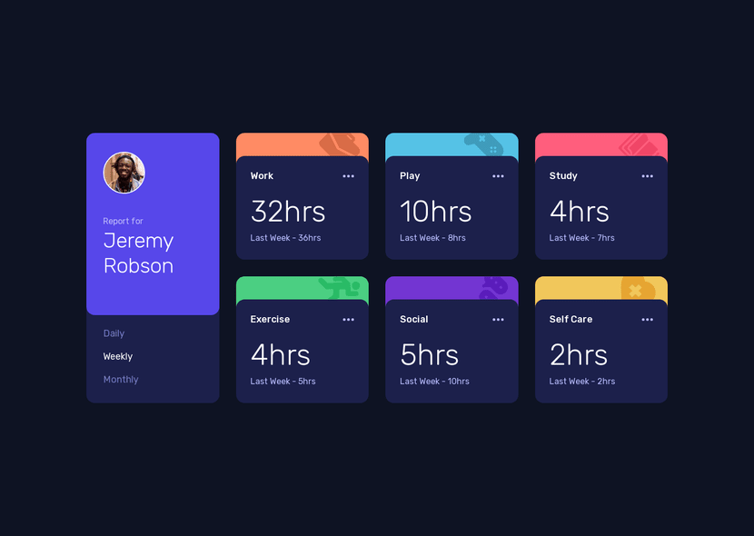

# Time Tracking Dashboard



## Hello! 💫

This is my solution to the ["Time Tracking Dashboard" challenge by Frontend Mentor](https://www.frontendmentor.io/challenges/time-tracking-dashboard-UIQ7167Jw).

## Running 🚀

If you want to run this app in your machine, make sure you have NodeJS and Git installed and run the following commands:

```sh
# Clone this repository
git clone https://github.com/dcdm3g/time-tracking-dashboard

# Go to the created folder
cd time-tracking-dashboard

# Install dependencies
pnpm i

# Start the NextJS development server
pnpm dev
```

## Technologies Used ✨

- [NextJS](https://nextjs.org)
- [Tailwind CSS](https://tailwindcss.com)
- [Tailwind Variants](https://www.tailwind-variants.org)
- [TypeScript](https://typescriptlang.org)
- [Eslint](https://eslint.org)
- [Prettier](https://prettier.io)
